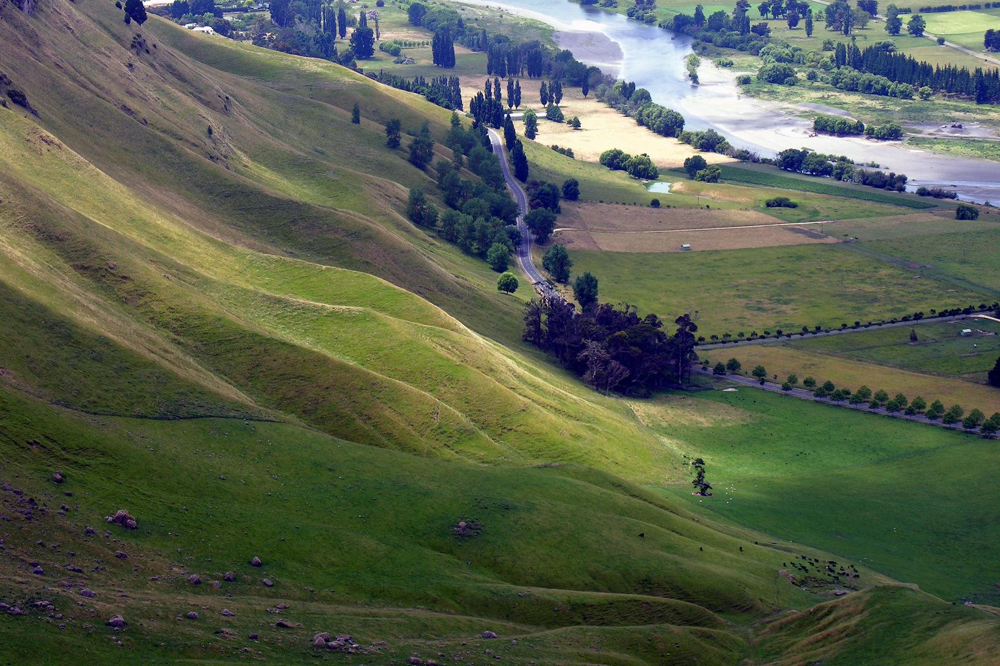
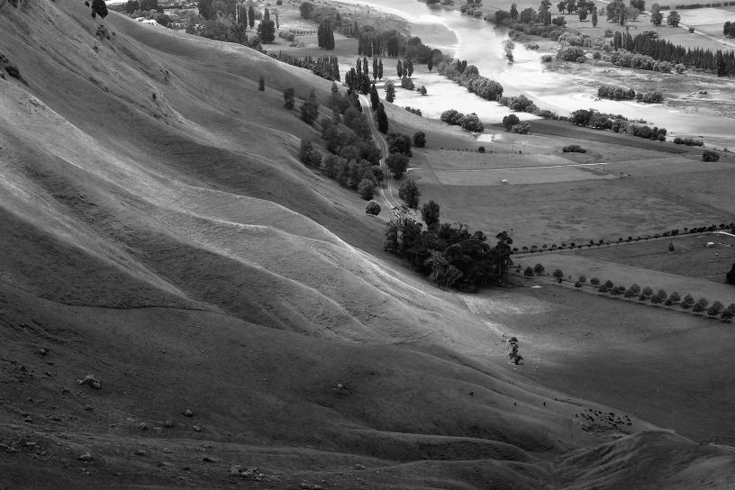
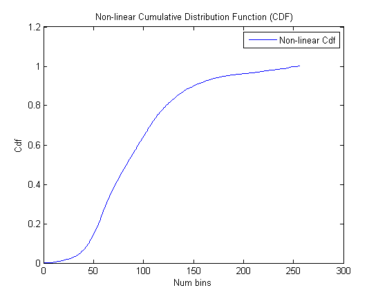
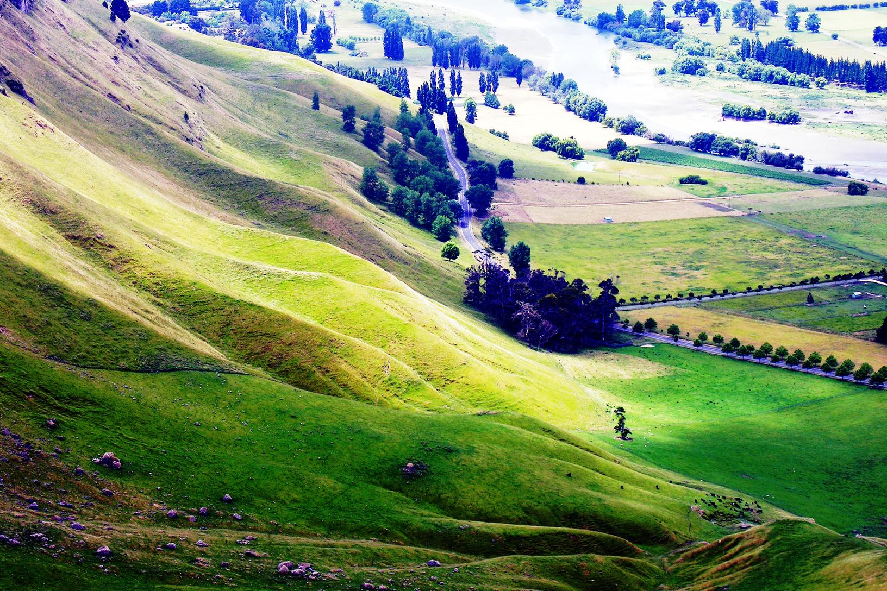

## dependencies
tested on Ubuntu 16.04  
CUDA(tested 9.2) OpenCV(tested 3.3.1) 

## compilation
### with Makefile:  
make  
### with Cmake:  
mkdir build  
cd build  
cmake ..  
make  


# Real time histogram equalization

The purpose of this project is to implement an efficient histogramming equalization algorithm for an input frame acquired from a webcam device in real time, the image is represented as RGB unsigned char values, it will be converted to grayscale and then computed the histogram. Based on the histogram, will be obtained an equalization function then applied to the original image to get the color corrected image, basically fulfilling the following steps:

* Convert the image from RGB to grayscale
* Compute the histogram of the image
* Compute the scan and prefix sum of the histogram to arrive at the histogram equalization function
* Apply the equalization function to get the color corrected image

## Background details
For an image that represent a full color space is expected to have a uniform distribution of luminosity values, this means that if we compute the Cumulative Distribution Function (CDF) we expect a linear curve for a color equalized image, if not we expect the curve to be non-linear (Picture 3). The algorithm equalizes the curve by computing a transformation function to map the original CDF to the desired one, being an almost linear function (Picture 5).

  
_**Picture 1: Input image**_


We first need to convert the image (Picture 1) to gray scale (Picture 2) by computing it’s luminosity values. These represent the brightness of the image and would allow us to simplify the histogram computation.


  
_**Picture 2: Grayscale image**_


  
_**Picture 3: For an image that is not color equalized we expect the curve to be non-linear**_


  
_**Picture 4: The computed transformation is applied to the original image to produce the equalized image**_  


  
_**Picture 5: the desired CDF being an almost linear function after histogram equalization**_


## Implementation Steps
Here the computation steps to be performed by each kernel illustrated with (serial) pseudo code:

### Convert the image from RGB to GrayScale
Implement a kernel that converts the the RGB image to grayscale:

```
for ii from 0 to height do
    for jj from 0 to width do
        idx = ii * width + jj
        # here channels is 3
        r = ucharImage[3*idx]
        g = ucharImage[3*idx + 1]
        b = ucharImage[3*idx + 2]
        grayImage[idx] = (unsigned char) (0.21*r + 0.71*g + 0.07*b)
    end
end
```

### Compute the histogram of gray Image
Implement a kernel that computes the histogram of the image:

```
histogram = [0, ...., 0]
//here len(histogram) = 256
for ii from 0 to width * height do
    histogram[grayImage[idx]]++
end
```

### Compute the Cumulative Distribution Function of histogram
This is a scan operation:

```
cdf[0] = p(histogram[0])
for ii from 1 to 256 do
    cdf[ii] = cdf[ii - 1] + p(histogram[ii])
end

Where p is the probability of a pixel to be in a histogram bin

def p(pixel):
return pixel / (width * height)
end
```

### Compute the minimum value of the CDF
This is a reduction operation using the min function:

```
cdfmin = cdf[0]
for ii from 1 to 256 do
    cdfmin = min(cdfmin, cdf[ii])
end
```

### Define the histogram equalization function
The histogram equalization function ( correct ) remaps the cdf of the histogram of the image to a linear function and is defined as:
```
def correct_color(val):
return clamp(255*(cdf[val] - cdfmin)/(1 - cdfmin), 0, 255)
end
```
### Use a clamp function
```
def clamp(x, start, end)
return min(max(x, start), end)
end
```

### Apply the histogram equalization function
Once you have implemented all of the above, then you are ready to correct the input image:
```
for ii from 0 to (width * height * channels) do
    uchar Image[ii] = correct_color(ucharImage[ii])
end
```

### Demo on YouTube
https://www.youtube.com/watch?v=LHSSxSk55hQ  with the following experimental setup:  

### Hardware setup
* Notebook Intel Core i7-3630QM and CPU @ 3.40 GHz, 4 cores and 8 threads, Ram 6 GB
* GPU Nvidia GeForce GT 640M, 709 MHz, 384 CUDA cores, Ram 2 GB

### Software setup
* Operating System Linux Archlinux
* CUDA SDK 8.0
* host compiler GCC 5.1
* device compiler NVCC 8.0.44 (with parameters: -O3 for host and device optimizations, -sm_30 for compute capability 3.0 support, -use_fast_math for fast math functions support)

Demo on YouTube using Jetson TK1: https://www.youtube.com/watch?v=Vje8XCtam7A
